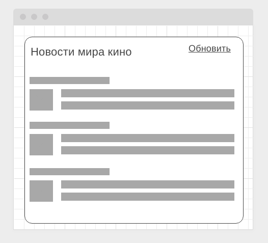

### Loading Styling

#### Легенда

Сейчас модно показывать интерфейсы загрузки вроде следующего:

#### Описание

Реализуйте подобный интерфейс, закешировав статические ресурсы и показывая этот внешний вид до момента загрузки данных.

Даже если у пользователя нет подключения, страница всё равно должна отображаться, но в режиме загрузки и после неудачной попытки соединения переходить в режим:

Для эмуляции задержки - [koa-slow](https://github.com/bahmutov/koa-slow).

Для кеширования - плагин Workbox.
